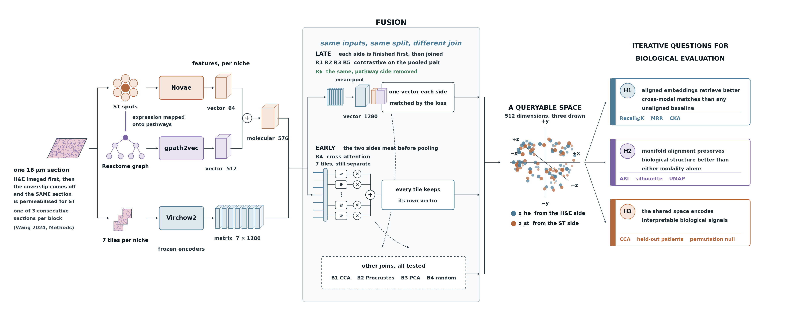

# omic<span style="color:#5DCAA5">stra</span>

a multi-agent MCP server for cross-modal embedding alignment and evidence-based routing in spatial biology. it exposes fixed scientific protocols as tools and returns evidence; the client holds the model. alignments are evaluated against declared metrics, and questions are routed from a cohort's own recorded evidence, refusing when that evidence is absent. foundation model encoders are pluggable; integration strategy is a configurable experimental dimension, not a fixed pipeline choice.

the seed implementation evaluates 92 TNBC patients from [Wang et al. 2024](https://www.nature.com/articles/s41467-024-54145-w) using H&E morphology (Virchow2 primary, UNI2 swap) and spatial transcriptomics (Novae GNN).

[](https://github.com/teslajoy/omicstra/actions/workflows/release.yml)
[](LICENSE)
[](https://doi.org/10.5281/zenodo.22666752)

`v1.0.0` `ResearchHub Foundation grant` `Brenden-Colson Center / Sears Lab, OHSU`

**v1.0** ships the read path (inventory, EDA, admissibility gate, routing) over
stdio and HTTP, the alignment and evaluation stages verified bit-identical
against the published grid, and the seed cohort's evidence pack in the repo, so a
fresh clone can route without training anything. The package itself ships no
cohort: `pip install omicstra` gets the contracts, and you point it at a cohort
directory.

**v1.1** is `omicstra run`: embeddings extracted here rather than resolved, the
niche join, H1/H2/H3 as a chain, and a promotion step where a person approves the
pack, with the report rendered from a cohort-agnostic template. Laptop-only for
both.

That report is a **template, not this cohort's report**. The renderer takes a
pack and a record ledger and knows nothing about tnbc-92 - sections appear
because a record exists, so a cohort that never ran H3 has no H3 section and says
why. That is what makes a second cohort's report free: same code, different
declarations. See `design/v1_1_scope.md`.

---

## analysis pipeline



**Figure 1 | Cross-modal alignment of histopathology and spatial transcriptomics
at niche scale.**

A single 16 µm section is stained and imaged for H&E, after which the coverslip is
removed and the same section is permeabilised in situ for spatial transcriptomics,
so morphology and expression share physical coordinates with no registration error
between them (one of three consecutive sections per frozen block; Wang et al.
2024). The unit of analysis is a niche of seven neighbouring spots (100 µm spot
diameter, 150 µm centre-to-centre; ~1,200-1,400 cells).

**Left** - two measurements yield three representations. Virchow2 encodes seven
H&E tiles per niche as a 7 × 1280 matrix; Novae encodes the spatial counts as a
64-d vector; gpath2vec encodes Reactome pathway activity inferred from those same
counts as a 512-d vector, concatenated with Novae to a 576-d molecular vector. All
encoders are frozen.

**Centre** - ten arms differ only in how the two sides are joined. Six are trained
contrastively (labelled R) and four are closed-form baselines with no training
(labelled B). Five contrastive arms mean-pool the seven tiles into a single 1280-d
vector before the two sides meet - four over the full molecular vector (R1, R2,
R3, R5) and one with the pathway representation removed (R6) - while a sixth
leaves the tiles un-pooled and lets the molecular side attend over them
individually (R4, cross-attention). The baselines join the two sides directly by
canonical correlation (B1), orthogonal Procrustes rotation (B2), principal
components (B3), or a random projection as an untrained control (B4). Inputs, the
patient-stratified split (85/15, seed 42) and all downstream evaluation are held
identical across arms.

**Right** - every arm projects to a shared 512-d space and is evaluated on
35,594 niches from 14 held-out patients: cross-modal retrieval (H1; Recall@K,
MRR, median rank, alignment gap, AUC, CKA), preservation of biological structure
(H2; ARI, silhouette) and pathway interpretability (H3; canonical correlation
against a permutation null).

---

## hypotheses

| | | metrics |
|---|---|---|
| **H1** | aligned embeddings retrieve better cross-modal matches than any unaligned baseline | Recall@K - MRR - median rank - alignment gap - AUC - CKA |
| **H2** | manifold alignment preserves biological structure better than either modality alone | |
| &nbsp;&nbsp;&nbsp;&nbsp;*A* | spatial states cluster more coherently in the aligned space than in either modality alone | ARI - silhouette |
| &nbsp;&nbsp;&nbsp;&nbsp;*B* | alignment quality varies across compartments - morphologically distinct ones (tumour, TLS, necrosis) above ambiguous ones (high- vs low-TIL stroma) | matched-pair cosine per compartment |
| **H3** | shared space encodes interpretable biological pathway signals | CCA vs permutation null |

early vs late fusion is an experimental variable, not an assumption. 

---

## seed cohort results (v3, 10-run grid)

evaluated on **35,594 niches across 14 held-out TNBC patients** (zero patient leakage across train / val / test). 6 contrastive runs (R1-R6) + 4 classical baselines (B1-B4):

- **H1 (cross-modal retrieval).** R4 wins. AUC 0.859 (95% CI 0.855-0.862). R4 is the only run using cross-attention - the other 5 contrastive runs use late fusion (mean-pooled H&E + independent MLPs).
- **H2 (biology preservation).** Split outcome. Late-fusion contrastive (R1, R6) wins K-means MC ARI; R4 still encodes MC biology at linear-probe parity. KMeans-ARI is geometry-biased - load-bearing diagnostic is the linear probe.
- **H3 (pathway transfer).** R4 wins again. 15/15 cells BH-FDR < 0.05 cross-patient (Welch z 3.8-5.7). At DAG resolution, R4 stays best (78% sig nodes) on clinically interpretable hits: BTLA checkpoint, IL signaling, IFN regulation, ECM collagen biology.

**R4 = the only non-late-fusion run** (cross-attention between the niche's 7 Virchow2 tile tokens and the 576-d ST vector). H1 + H3 both reward keeping local morphological heterogeneity un-pooled.

---

## the loop

a **level** is what code is allowed to do (LEVEL 0/1/2 in the tree below); the
**loop** is the order a cohort goes through. they are different axes and the
words are easy to confuse:

```
layer 0: EDA (gate)
  is data usable? quality? signal? modalities alignable?
  -> proceed / proceed with caution / stop

layer 1: pipeline (execution)
  embed -> align -> eval
  fixed protocol, deterministic with seed

layer 2: karpathy loop (outer optimization)
  editable asset: alignment_config.json
  scalar metric: Recall@K or MRR (fixed)
  proposes config -> runs pipeline -> scores -> keeps or discards
  output: git log of validated decisions + winner.json
```

program.md defines search space, constraints, stopping criteria.

embedding dimensions: Virchow2 1280d (primary) / UNI2 1536d (alternative) - Novae GNN 64d (novae_latent) -> shared 512d

alignment strategies (experimental variable):
```
  late interaction  - tiles aggregated per spot (mean/max),
                      then independent MLPs -> shared 512d (InfoNCE)
  early interaction - tile-level cross-attention between H&E tokens
                      and ST spot before projection (~4M params, local K tiles)
  comparison: does tile-level morphological detail lost at aggregation
              matter for cross-modal alignment quality?
```

---

## repo structure

audited against the filesystem 2026-09-09. `·` is built, `○` is named in the design and **not yet built** - kept here because the name is referenced elsewhere, not because it exists.

```
omicstra/
│
· CLAUDE.md                          # north star for Claude Code
· EDA.md                             # gate - data quality checks before pipeline
· PLAN_RULES.md                      # constraints - no alignment until EDA passes
· MODELS.md                          # training provenance + tissue compatibility per model
· MODALITY_TEMPLATE.md               # the contract a new modality generates against
· CITATION.cff  server.json          # citation metadata - MCP registry entry
· .mcp.json  .env.example            # MCP server entry - optional tracing only
│
· design/                            # the planning tree - tracked, this is where "what next" lives
│   · v1_1_scope.md                  # the NEXT release's boundary. read before adding
│   · mcp_plan.md  workflow.md       # engineering plan - the executable graph
│   · decisions.md                   # what is decided, and by whom
│   · progress.md  status.md         # build log - repo snapshot
│
· src/omicstra/                      # the pip-installable package - src layout
│   · graph.py                       # LEVEL 0 - the only entry, the only checkpointer
│   · graphs/                        # LEVEL 1 - one per gate, each can interrupt()
│   │   · eda.py                     #   inventory -> profile -> gate -> escalate
│   │   · route.py                   #   orchestrator -> 3 agents -> judge -> ask_human
│   │   ○ encode.py  promote.py      #   v1.1 - compute, and the reviewed evidence step
│   · protocols/                     # LEVEL 2 - order, applicability, authority. no maths
│   │   · inventory.py               #   8 steps: files .. bind - "what is this data"
│   │   · eda.py                     #   10 checks registered - "is it usable"
│   │   · align.py                   #   4 stages. resolve-only; compute is v1.1
│   │   · evaluate.py                #   6 guards - becomes a chain in v1.1
│   · measures/__init__.py           # the MATHS. pure functions, no ctx, no order,
│   │                                #   no authority. callable from a notebook
│   · contracts/                     # READS a declaration, decides nothing
│   │   · project.py                 #   a cohort's project.json
│   │   · routing.py  eda.py         #   contract + evidence · contract + calibration
│   · configs/                       # the CONTRACTS, inside the wheel so an
│   │   · data_contract.json         #   installed server can find them. 8 declared
│   │   · eda_contract.json          #   roles · which checks, which criteria
│   │   · routing_contract.json      #   task taxonomy, outcome vocabulary, rules
│   │   · compute_contract.json      #   6 gates: 5 preflight, 1 mid-run
│   · adapters/wang_st.py            # a cohort's files -> AnnData conforming to raw_counts
│   · agents/modality.py             # he / st / pathway agents - read recorded evidence
│   · mcp/server.py                  # 8 tools, 3 resources, stdio + http. zero model calls
│   · records.py  artifacts.py       # the record contract - inventory/eda_summary io
│   · settings.py  cli.py            # 8 commands. settings imports nothing from omicstra
│   · routing.py  eda.py  figures.py # resolve + ledger · gate · plots
│
│   the rule: a thing gets its own graph only if it can ask a human;
│   everything else is a protocol. a new .py never lands in src/omicstra/ directly.
│
· configs/v3/                        # R1_v3 .. R6_v3 run configs (cohort runs, not contracts)
│
· projects/                          # committed - one directory per cohort
│   · {project_id}/
│       · project.json  program.md   # encoders, runs, metric · search space + constraints
│       · cohort.json                # DECLARED: subject_id_column, classification,
│       │                            #   compute_backend, client_model_backend - fail closed
│       · platform.json              # DECLARED per sample: platform, position_columns, pitch
│       · inventory.json             # inventory protocol output - conformance report
│       · eda_summary.json           # EDA gate output
│       · routing_evidence.json      # this cohort's measured evaluation - never inherited
│
· site/{institution}/  [ignored]     # compute.md governance.md - served as MCP resources
· scripts/                           # the chain behind the published results
· tests/                             # 114 - conformance, routing, eda authority
│   · fixtures/                      #   the pinned H1 summary, sha-guarded
· knowledge/reactome/                # shared domain assets - committed
· docs/                              # -> teslajoy.github.io/omicstra
· notebooks/                         # exploration - embeddings - experiments - final
· runs/  data/  demo/  [ignored]     # traces - inputs + embeddings - talk assets
```

---

## extending to a new modality

`MODALITY_TEMPLATE.md` is the contract a new modality agent (single-cell, protein, electron microscopy, etc.) must satisfy: a frozen foundation-model encoder, a niche-aggregation step, a clean ST/H&E-equivalent feature parquet shape, and the construct-validity guards the eval agent enforces. each modality adds one row to the alignment grid and one entry to the routing contract.

---

## seed cohort

[Wang et al. 2024](https://www.nature.com/articles/s41467-024-54145-w) - 92 TNBC patients, co-registered ST + H&E WSI. platform: original Spatial Transcriptomics (Stahl et al. 2016, KTH/Spatial Transcriptomics AB) - 1934 spots/array, 100um diameter, 150um center-to-center.

> corrected 2026-08-12: previously read 200um center-to-center. Wang 2024 Methods states 150um and the lattice measures to it - nearest neighbour 161.6 px with the (+2,0)/(0,+2) offsets at 216/240 px, i.e. NN x sqrt(2), so NN is centre-to-centre. at 150um that is 0.93 um/px and the array spans 6.5 x 6.9 mm, matching the stated capture area; at 200um it would span 8.7 x 9.2 mm, which no ST array is.

| resource | url |
|---|---|
| processed data | [doi:10.5281/zenodo.14204217](https://doi.org/10.5281/zenodo.14204217) (mc-labels release also at [doi:10.5281/zenodo.8135721](https://doi.org/10.5281/zenodo.8135721)) |

---

## quick start

```bash
pip install omicstra                # serves, routes, gates - no numpy, no tensor libraries
pip install "omicstra[measure]"     # + the numerics, for computing inventory and EDA steps
```

omicstra ships no model and no client: any MCP client supplies the model. OHSU
runs it behind a pydantic-ai front on ARC with Bedrock, and that front is a
separate package. the server holds no key and makes no outbound call.

the package ships its contracts and no cohort. point it at one:

```bash
export OMICSTRA_PROJECT_DIR=/path/to/projects/tnbc-92
omicstra selftest        # start here: asserts the routing rules hold on this cohort
omicstra describe        # what the cohort declares - platform, encoders, roles
omicstra families        # which questions it can answer, and which it cannot yet
omicstra route cross_modal_retrieval
```

`omicstra --help` lists all eight: `selftest`, `describe`, `families`, `route`,
`gate`, `eda`, `decisions`, `init`. **`selftest` first** - it tells a new cohort
owner whether their declarations and evidence hang together before they spend
time on anything else.

**stdio** - the usual client config:

```json
{ "mcpServers": { "omicstra": {
    "command": "python", "args": ["-c", "from omicstra.mcp.server import serve; serve()"],
    "env": { "OMICSTRA_PROJECT_DIR": "/path/to/projects/tnbc-92" } } } }
```

**streamable-http** - `serve(mode="http")`, then note the envelope:

```bash
curl -s -X POST http://127.0.0.1:8000/mcp \
  -H 'Content-Type: application/json' \
  -H 'Accept: application/json, text/event-stream' \
  -d '{"jsonrpc":"2.0","id":1,"method":"tools/list","params":{"_meta":{
        "io.modelcontextprotocol/protocolVersion":"2026-07-28",
        "io.modelcontextprotocol/clientCapabilities":{}}}}'
```

the `_meta` block is not optional and is the first thing a new http caller gets
wrong. protocol revision 2026-07-28 removed the initialize handshake, so the
version travels on **every** request rather than being negotiated once. a call
without it is refused with `-32602`, naming the two keys it wants.

a cohort with no evidence pack is **not routable**, and the compute path refuses
rather than improvising: `route` declines instead of inheriting another cohort's
winner, and `run_align` raises `ComputeUnavailable` naming the missing artifact
and the script that builds it. that refusal is the expected first response on a
fresh install, not a failure.

---

## stack

| layer | tool |
|---|---|
| orchestration | LangGraph StateGraph |
| model | supplied by the MCP client; the server ships none |
| tracing | OpenTelemetry-ready; LangSmith optional via env, not a dependency |
| resources | `omicstra://eda-contract`, `routing-contract`, `project/{id}/routing-evidence` |
| H&E foundation model | Virchow2 (primary, 1280-d) - UNI2 as swap (1536-d) |
| ST foundation model | Novae GNN |
| pathway | gpath2vec + biological pathway embeddings |
| alignment | contrastive MLP + cross-attention bridge |
| compute | laptop (v1.0); SLURM planned |
| interface | Model Context Protocol |

---

## reproducibility

every run writes `runs/{project_id}/{run_id}/` - config, QC, embeddings, alignment, evaluation, synthesis. `notebooks/final/` contains the best run as a notebook, drafted with a model from the run trace and reviewed by hand; reruns go top-to-bottom with a fixed seed.

---

## deliverables

- [x] v3 10-run alignment grid on TNBC-92
- [x] pip-installable MCP server (MIT) - verified on python 3.11 / 3.12 / 3.14
- [ ] alignment checkpoint + model card (Hugging Face)
- [ ] embeddings and niche join deposited (Zenodo)
- [ ] second-modality plug-in via `MODALITY_TEMPLATE.md` (target: CODA or CyCIF)

---

## how the evidence pack is produced

The router reads `projects/{id}/routing_evidence.json`. **No script writes it.**

```
eval summaries  ──▶  proposed evidence   deterministic: winners, margins, refusals
                ──▶  a person reviews, edits the notes, approves
                ──▶  routing_evidence.json
```

Deciding which metric answers which task family, what the floors are, and which
caveat attaches to which candidate is editorial work - the file's own notes
argue with the report in places. Generating it would invent the judgements it
records, so `run_eval` scores the grid and **resolves** the pack; it never
produces one.

**In v1.0 that promotion step is manual and recorded in `docs/`. In v1.1 it is
`omicstra promote`** - a gate, not a protocol, because it asks a person.

The acceptance test for the port is pinned in `tests/fixtures/`: a full-grid
rerun with one retrained baseline reproduced every numeric field of the H1
summary, and the fixture is checked against the evidence pack so the router can
never quote a number nothing produced.

---

## declared deviation from the proposal

The registered report put a model **inside** the orchestration: one model for
intent classification and routing, another for hypothesis evaluation, with
conditional routing in the graph.

**The build moved the model to the client and made routing a deterministic rule
over evidence.** The server holds no model, generates no code, and executes
nothing a model wrote. A model has three narrow jobs, all on the client side:
classify a question into a closed task set, choose among enumerated options at a
gate, and write the "why". Everything downstream resolves from lookup tables.

The reason is reviewability. A server with no model is portable across clients,
has no second router to reason about, and can be reviewed for what it does rather
than what it might decide. It also means swapping the model cannot change a route
- the same question reaches the same method, because the method came from
recorded evidence rather than from inference.

**Deliverables, metrics and hypotheses are unchanged.**

---

## team

**Nasim Sanati, M.S.** - AI/ML systems - MCP server - agent orchestration - embedding pipelines  

Brenden-Colson Center for Pancreatic Care / Sears Lab, OHSU

---

## citation

```bibtex
@software{sanati2026omicstra,
  author  = {Sanati, Nasim},
  title   = {omicstra: a multi-agent MCP server for cross-modal embedding alignment
             and evidence-based routing in spatial biology},
  year    = {2026},
  doi     = {10.5281/zenodo.22666752},
  url     = {https://github.com/teslajoy/omicstra},
  license = {MIT}
}
```

*funded by ResearchHub Foundation ([doi:10.55277/researchhub.6ou1w3h3](https://doi.org/10.55277/researchhub.6ou1w3h3))*  
*nonprofit recipient: OHSU Foundation - EIN 23-7083114*  
*seed cohort: Wang et al. 2024, Nat. Commun. 15:10232*
