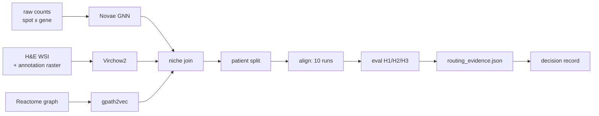

# Data structure flow

What shape goes into each step and what shape comes out. Every schema below was
read off the artifacts on disk on 2026-08-20, not transcribed from a spec.

Notation: `n` = rows, `d` = vector width. A cell written `float32[1280]` is a
single parquet cell holding a 1280-element list, not 1280 columns.



---

## 0 · Raw inputs

Three independent sources. Only the first two are cohort data; the third is
public reference.

### 0a · spatial transcriptomics counts

```
 data/inputs/byArray/{slide}/{subarray}/selection.RData
 ┌─────────┬───────────────┬───────────────┬─────┐
 │ spot_id │ ENSG…1.14     │ ENSG…2.7      │ ... │   raw integer counts
 ├─────────┼───────────────┼───────────────┼─────┤
 │ 2x6     │       0       │      14       │     │   spot_id is a coordinate
 │ 2x7     │       3       │       0       │     │   string "{col}x{row}"
 │  ...    │               │               │     │
 └─────────┴───────────────┴───────────────┴─────┘
   n = 1,075 tissue-selected spots  x  27,567 genes
   median 16,492 UMI/spot · versioned Ensembl IDs · GRCh38 GENCODE v38
```

| variant | shape | use |
|:--|:--|:--|
| `selection.RData` | 1,075 x 27,567 | **this one** - tissue-filtered raw integer counts |
| `all.RData` | 1,931 x 30,263 | full grid, raw |
| `rawCountsMatrices/*.tsv` | - | **do not use.** normalised + batch-corrected floats despite the name |

### 0b · spot → pixel mapping. there is no GeoJSON, and we do no registration

The same `selection.RData` holds **two** R objects. `cnts` is §0a. The other is
`spots`, and it is the entire coordinate story:

```
 selection.RData :: spots            data.frame, 1,075 x 6
 ┌───────┬─────┬─────┬───────┬───────┬─────────┬─────────┐
 │       │  x  │  y  │ new_x │ new_y │ pixel_x │ pixel_y │
 ├───────┼─────┼─────┼───────┼───────┼─────────┼─────────┤
 │ 2x12  │  2  │ 12  │ 2.04  │ 12.05 │ 1460.9  │ 1532.4  │
 │ 2x14  │  2  │ 14  │ 2.05  │ 14.08 │ 1461.6  │ 1776.7  │
 │ 2x16  │  2  │ 16  │ 2.03  │ 16.05 │ 1459.2  │ 2013.4  │
 └───────┴─────┴─────┴───────┴───────┴─────────┴─────────┘
   row name  = spot_id "{x}x{y}"
   x, y      = nominal integer array index
   new_x/y   = DETECTED position, sub-integer
   pixel_x/y = H&E pixel coordinate, "small" image frame
```

**`new_x`/`new_y` being non-integer is the whole point.** Wang ran spot detection
on the brightfield image itself - the ST array's fiducial frame is visible in
H&E - so `pixel_x`/`pixel_y` are *measured on the image*, not projected from a
nominal lattice. Combined with the fact that both assays come off the **same
16um section** (stained, imaged at 20x, coverslip removed, permeabilised in
place), there is no registration step in this pipeline and no registration error
to propagate.

Our only geometric operation is one scalar, in `extract_virchow2.py:55`:

```
 SCALE_TO_HD = HD_SIZE / HE_SMALL_SIZE = 31744 / 9523 = 3.3334
```

because `pixel_x/pixel_y` live in the 9,523 px "small" frame while tiles are cut
from `imagesHD/` at 31,744 px. That is it - one multiply, no affine fit, no
control points, no `.geojson`.

Consistency check: `2x12` -> `2x14` is 1776.7 - 1532.4 = **244.3 px** for a +2
y-index step, against the 240 px `(0,+2)` offset recorded in `CLAUDE.md`. The
lattice is a square grid rotated 45 degrees and ~11% anisotropic, so the true
nearest neighbour is the diagonal at 161.6 px, and that is the 150um
centre-to-centre distance.

### 0c · pathologist annotation, also pre-computed per spot

The polygons were drawn in QuPath and **Wang rasterised them and counted pixels
under each spot disc**. We consume the counts, never the image.

```
 byArray/{slide}/{pos}/annotBySpot.RDS       integer matrix, 1,926 x 18
 ┌───────┬─────────┬───────┬──────────┬────────────┬─────┐
 │       │ Nothing │ Tumor │ Necrosis │ Fat tissue │ ... │
 ├───────┼─────────┼───────┼──────────┼────────────┼─────┤
 │ 2x6   │  5,227  │   0   │    0     │     0      │     │
 │ 2x8   │    0    │   0   │    0     │     0      │     │
 └───────┴─────────┴───────┴──────────┴────────────┴─────┘
   every row sums to 10,557 - the spot disc area in raster pixels
   `imageAnnotations/*.png` (7936 x 7936, palette mode) is the same
   information as a picture. 94 files. nothing in the pipeline reads it.
        │
        └─► extract_biological_signals.py ─► morphology_labels.tsv
 ┌─────────────┬─────────┬─────────────────┬──────────────────┬────────────┐
 │ subarray_id │ spot_id │ dominant_5class │ dominant_18class │ frac_Tumor │ …
 ├─────────────┼─────────┼─────────────────┼──────────────────┼────────────┤
 │ CN1_C1      │ 2x12    │ tumor           │ Tumor            │   0.71     │
 └─────────────┴─────────┴─────────────────┴──────────────────┴────────────┘
   24 columns: 2 dominant labels + 1 fraction + background + 20 frac_* columns
   fractions use a TISSUE-ONLY denominator; background-dominated spots dropped
```

**15 tissue categories, not 18.** The 18 raster columns are 15 tissue classes
plus `Nothing`, `Artefacts`, `Hole (whitespace)`.

**A label is a plurality, not a description.** The median spot is only 59% one
category by tissue area and 51% are below 60%. `dominant_18class_fraction`
carries that number per spot, so it can be filtered on - it usually is not.

### 0d · Wang's expression-derived labels

```
 mc_labels.tsv                              mc_weights.tsv
 ┌──────────┬─────────┬────────────┬───────────────┬─────────────┐
 │ subarray │ spot_id │ patient_id │ intra_cluster │ megacluster │
 ├──────────┼─────────┼────────────┼───────────────┼─────────────┤
 │ CN1_C1   │ 2x12    │     1      │       2       │     11      │   1..14 only
 └──────────┴─────────┴────────────┴───────────────┴─────────────┘
```

`megacluster` takes values **1-14 only**. Any `-1` seen downstream is our join
fill, not a Wang label - see §2.

---

## 1 · Encoders → per-subarray caches

All three encoders are **frozen**. Nothing in this flow fine-tunes them.

| | in | method | out |
|:--|:--|:--|:--|
| **H&E** | 20x RGB tiles at spot centres | Virchow2, 1280-d CLS token | `virchow2_niche/{subarray}.npy` |
| **ST** | `selection.RData` counts + coordinates | Novae GNN, 64-d GAT output | `novae_niche_full/{subarray}_novae_embeddings.parquet` |
| **pathway** | Reactome graph | gpath2vec, metapath2vec walks | one cohort-wide parquet |

```
 virchow2_niche/{subarray}.npy          + {subarray}_meta.tsv
 ┌───────────────────────────────┐      ┌─────────┬─────────┬────────────────┐
 │ float32  (1111, 1280)         │      │ pixel_x │ pixel_y │ neighbor_count │
 │ row i  ────► niche i          │      └─────────┴─────────┴────────────────┘
 └───────────────────────────────┘        row-aligned with the .npy
```

Novae emits **raw GAT output** - mean norm 2.618, no normalisation of its own.
Everything downstream that consumes it LayerNorms first. It is z-scored per
subarray at join time.

---

## 2 · Niche join → the analysis unit

One niche = **centre spot + 6 spatial neighbours = 7 spots ≈ 1,400 cells**, about
0.5 mm across. The lattice is 150um centre-to-centre, so a k=6 niche is 4
neighbours at ~150um plus 2 at ~200um - a lozenge, not a hexagon.

```
 data/embeddings/niches_v3/{subarray}.parquet     259 files
 ┌──────────────────────┬────────────────────┬────────────────────────────────┐
 │ column               │ type               │ what                           │
 ├──────────────────────┼────────────────────┼────────────────────────────────┤
 │ spot_id              │ string             │ centre spot, "{col}x{row}"     │
 │ subarray             │ string             │ e.g. TNBC10_CN5_D2             │
 │ patient_id           │ int64              │ the split key                  │
 │ archetype            │ int64              │ patient-level - diagnostic only│
 │ compartment          │ string │ null      │ pathologist category, 15-class │
 │ mc_megacluster       │ int64              │ 1-14, or -1 = join fill        │
 │ mc_weights_niche     │ float[14]          │ SUPERVISION ONLY, never input  │
 │ virchow2_niche       │ float[1280]        │ mean of the 7 tiles            │
 │ virchow2_cell_tokens │ float[7 x 1280]    │ the 7 tiles, un-pooled         │
 │ novae_niche          │ float[64]          │ z-scored per subarray          │
 │ gpath2vec_niche      │ float[512]         │ pathway anchor                 │
 │ tls                  │ double             │ Cabrita 30-gene score          │
 │ neighbor_spot_ids    │ list[string]       │ provenance of the 7            │
 └──────────────────────┴────────────────────┴────────────────────────────────┘
   208,786 niches across 259 subarrays · 94 patients on disk, 92 published
   per subarray: min 111 · median 792 · max 1,564 rows
```

The `.npy` above is 1,111 rows for the subarray whose joined parquet is 846. The
difference is the gpath2vec coverage drop - the join is an inner join, and the
cache is what existed before it.

Three properties of this table decide most of what is possible downstream.

**`compartment` is null on about two thirds of rows.** Wang annotated **one of
the three consecutive sections** per patient. 70,873 of 208,786 niches carry a
category (33.9%); 13 of 38 held-out subarrays. Grey in an annotation figure is
mostly *unannotated*, not "some other category".

**`mc_megacluster == -1` is ours.** `mc_labels.tsv` holds 1-14 only. The join
covers 96.3% (200,973 niches); the remaining 7,813 across 89 patients get -1, and
that fill is **6.31x enriched for necrosis** - the join loses necrotic tissue
preferentially. It is not NaN, so `.notna()` filters do not remove it, and 882
test niches (2.48%) still reach H2-A as a 13th class.

**67,131 niches were dropped for gpath2vec coverage** before this table existed.

**`mc_weights_niche` is supervision only.** It is never an input feature. Using
the same signal as both ST input and positive-pair definition is the circularity
this project explicitly guards against.

---

## 3 · Split

```
 runs/tnbc-92_v3/{run}/split.json
 ┌──────────────────┬──────────────────────────────┐
 │ seed             │ 42                           │
 │ train_patients   │ int[64]                      │
 │ val_patients     │ int[14]                      │
 │ test_patients    │ int[14]                      │
 └──────────────────┴──────────────────────────────┘
```

**By patient, never by niche.** A patient's three subarrays are consecutive 16um
sections of one frozen block - near-duplicates in z. Splitting at niche or
subarray level would put near-copies of the same tissue on both sides.

---

## 4 · Alignment → shared space

```
 in                              method                    out
 ┌───────────────────┐                                ┌──────────────────┐
 │ virchow2_niche    │ 1280 ──┐                       │ z_he  float[512] │
 │ virchow2_cell_tok │ 7x1280 ├──► one of 10 runs ──► │ z_st  float[512] │
 │ novae ⊕ gpath2vec │  576 ──┘     (see METHODS)     │ attn  float[7]   │
 └───────────────────┘                                └──────────────────┘
   both outputs L2-normalised - every similarity downstream is a cosine
   `attention_weights` is present on R4 only; null on the late-fusion runs
```

```
 runs/tnbc-92_v3/{run}/embeddings_test.parquet        n = 35,594
 ┌─────────┬──────────┬────────────┬───────────┬─────────────┬──────┬──────┬──────┐
 │ spot_id │ subarray │ patient_id │ archetype │ compartment │ z_he │ z_st │ attn │
 └─────────┴──────────┴────────────┴───────────┴─────────────┴──────┴──────┴──────┘
   35,594 test niches · 38 subarrays · 14 held-out patients
```

Alongside it, per run:

| file | shape | contents |
|:--|:--|:--|
| `run_config.json` | 16 keys | `loss`, `fusion`, `st_features`, `shared_dim` 512, `tau` 0.07, `lr` 5e-4, `epochs` 50, `seed` 42 |
| `metrics_h1_raw.json` | 12 keys | `auc`, `r1/r5/r10`, `mrr`, `median_rank`, `alignment_gap`, `cka_before` -> `cka_after` |
| `metrics_h1_ci.json` | 16 keys | Hanley-McNeil analytic CI **and** a 200-draw bootstrap CI, both stored |
| `checkpoint.pt` | - | trained runs only. B1-B3 are closed-form, B4 has `training_steps: 0` |

R4 for scale: `auc` 0.8591, bootstrap CI [0.8576, 0.8608], `cka` 0.119 -> 0.631,
`median_rank` 3,282 of 35,594.

**`r1` is 1.4e-4 and that is not a failure.** At 35k cross-patient candidates the
chance floor is ~2.8e-5. Absolute R@1 is uninformative at this scale, which is
why AUC is the primary metric - a locked deviation, recorded in
`PLAN_RULES.md:187-199`.

---

## 5 · Evaluation → one table per hypothesis

Nothing here is a neural network. Retrieval is cosine, clustering is k-means,
pathway transfer is canonical correlation, and the only fitted object is a
deliberately linear probe.

```
 runs/tnbc-92_v3/eval/
 │
 ├── H1/summary.json                          retrieval, all 10 runs
 │
 ├── H2/mc_coherence.parquet          n=29    run_id · view · ari · silhouette · n
 │   compartment_welch_contrasts.pq   n=54    run_id · distinct · ambiguous ·
 │                                            mean_* · n_* · z · direction
 │   compartment_cosine.parquet               within-compartment cosine
 │   tls_signature_cca.parquet                Cabrita score vs shared space
 │   metrics_h2_ci.json · mc_diagnostics/     kNN purity · linear probe ·
 │                                            rank-matched KMeans
 │
 └── H3/pathway_compartment_v3.pq    n=4,760  stId · name · compartment ·
     │                                        rate_in · rate_out · n_slides ·
     │                                        frac_slides · lift · diff · called
     ├── pathway_cca_gpath2vec_v3/            cross-patient transfer
     └── attention_by_compartment.parquet     R4 only - which tiles it looked at
```

The row counts are the point. **29 rows** in `mc_coherence` = runs x views, and
**54 rows** in the Welch table = runs x contrast pairs. These are small tables of
comparisons, not per-niche outputs - the per-niche layer stops at §4.

---

## 6 · Evidence → the routing contract

The split that makes the system portable: **the rules are cohort-free, the
measurements are not.**

```
 configs/routing_contract.json          projects/{id}/routing_evidence.json
 ┌────────────────────────────┐         ┌────────────────────────────────────┐
 │ contract_version  1.0      │         │ evidence_version  v3               │
 │ authority         dict[3]  │         │ project_id        tnbc-92          │
 │ outcomes          dict[4]  │         │ eval_scope        dict[5]          │
 │ decision_rules    dict[4]  │         │ method_names      dict[11]         │
 │ task_families     list[7]  │         │ tasks             dict[7]          │
 │ guards            dict[7]  │         │ contraindications list[1]          │
 │ evidence_contract dict[6]  │         │ open_flags        list[3]          │
 └────────────────────────────┘         │ scope_statement   str             │
   generalizable · ships with           └────────────────────────────────────┘
   the package                            measured · per cohort · never inherited
```

A cohort with no evidence file is **not routable**, and the system says so rather
than reusing another cohort's winner. `scope_statement` travels inside every
decision record so it cannot be summarised away.

The gate has the identical shape: `configs/eda_contract.json` (10 checks, a
verdict rule, thresholds only) against `projects/{id}/eda_summary.json` (this
cohort's measurements, verdict `proceed`).

---

## 7 · Decision → the record

```
 in                          method                        out
 ┌──────────────────┐    ┌──────────────────────┐    ┌────────────────────────┐
 │ question (text)  │──► │ model: question→task │──► │ task_id                │
 └──────────────────┘    └──────────────────────┘    └────────────────────────┘
                                                                │
 ┌──────────────────┐    ┌──────────────────────┐               ▼
 │ routing_evidence │──► │ rules: task→outcome  │──► RECOMMEND │ TIE │
 │ + contract       │    │      (deterministic) │    ESCALATE  │ REFUSE
 └──────────────────┘    └──────────────────────┘
```

Only the second half enters the record. `record_id` hashes the decision inputs,
not the timestamp - same question, same evidence, same id forever.

Four outcomes, not one. A system that only ever says yes is a recommendation
engine.

---

## Shapes at a glance

| stage | unit | n | width |
|:--|:--|--:|:--|
| raw counts | spot | 1,075 / subarray | 27,567 genes |
| Virchow2 cache | niche | pre-join, per subarray | 1,280 |
| Novae cache | niche | pre-join, per subarray | 64 |
| gpath2vec | niche | cohort-wide | 512 |
| **niche join** | **niche** | **208,786** | 1280 + 7x1280 + 64 + 512 + 14 |
| shared space | niche | 35,594 test | 512 + 512 |
| H1 metrics | run | 10 | 12 scalars |
| H2 coherence | run x view | 29 | 5 columns |
| H3 pathway | pathway x compartment | 4,760 | 13 columns |
| evidence | task family | 7 | - |
| decision | question | 1 | - |

The funnel is the story: 27,567 genes become 512 numbers, 208,786 niches become
7 task families, and a question returns one of four words.

---

## Known defects in the artifacts above

Recorded here because they are properties of the data structures, not of the
analysis.

| where | what |
|:--|:--|
| `eda_summary.json` `platform` | still reads **200um centre-to-centre**. The platform is 150um (`CLAUDE.md`, corrected 2026-08-12). Descriptive metadata, not a gate threshold, but it is a committed artifact the MCP gate reads |
| `niches_v3` `mc_megacluster` | `-1` fill reaches H2-A as a 13th class. `build_niche_join.py:276` asserts eval filters `< 0`; every consumer filters with `.notna()`, and -1 is not NaN |
| `eval_alignment_biology.py:59` | H2-C permutes at niche level while the TIME label is per-patient. Numerator and denominator may partly self-cancel - unverified |
| `runs/tnbc-92/` | the **v1 legacy grid**, ST side built on v1 gpath2vec and not regenerable. The live grid is `runs/tnbc-92_v3/`. Several older docs point at the wrong one |

See `docs/METHODS_alignment.md` for what each of the ten runs does to the 512-d
space between §4's input and output columns.